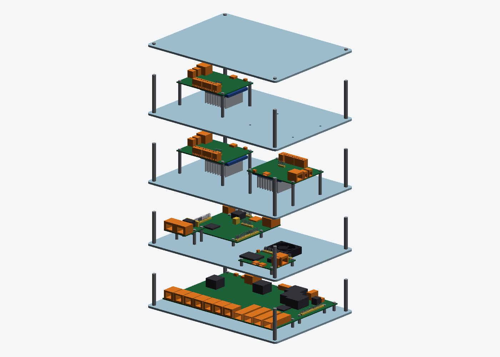
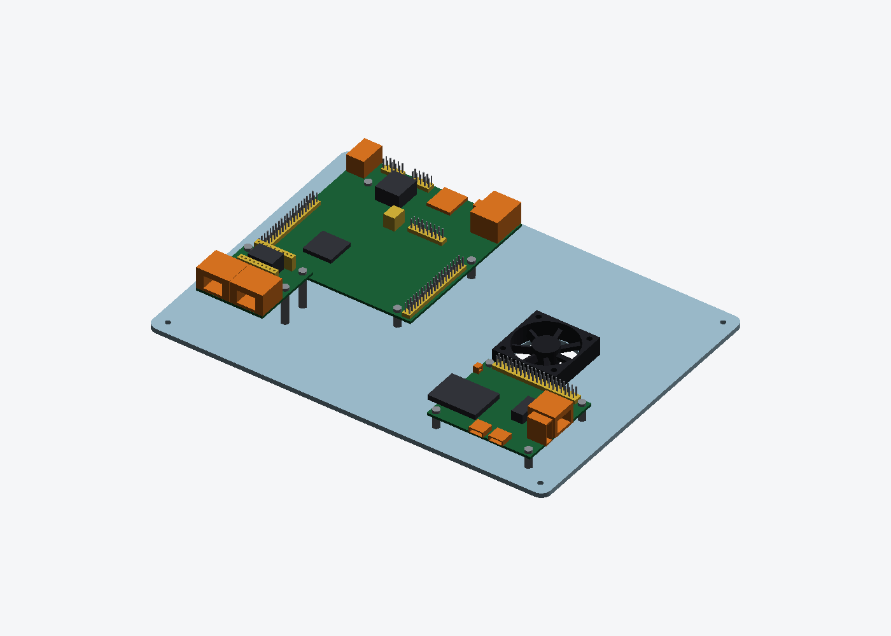
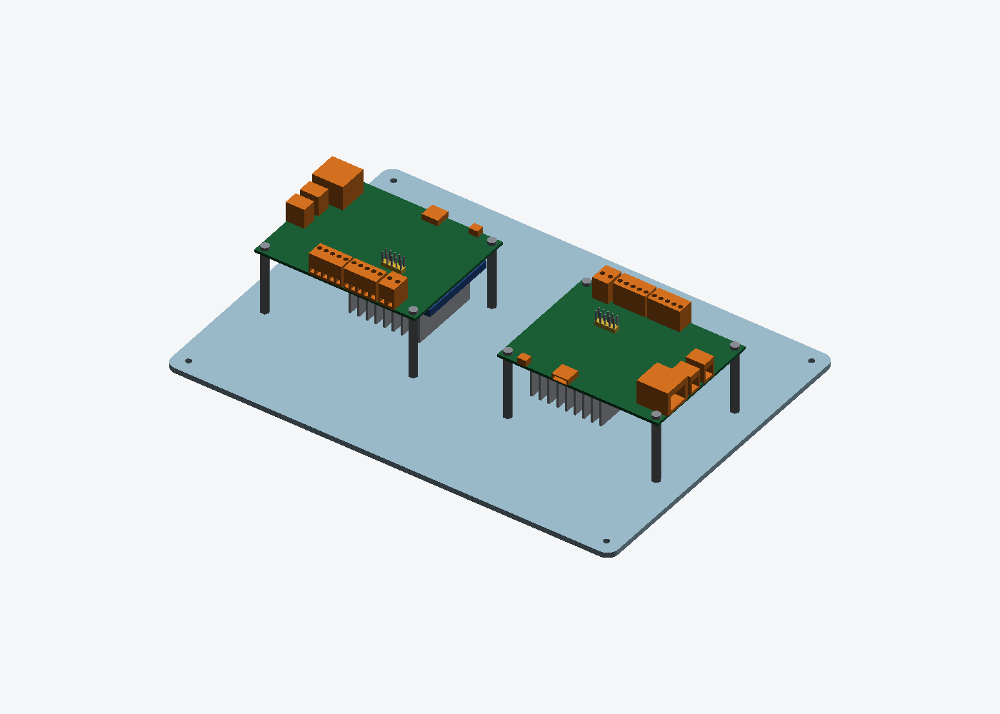

# lan9692-ring-rack

LAN9692 링용 아크릴 랙. 9692가 3대이고, 한 대가 스택 하나의 바닥이다. 스택 3개는 모두 같은 구성이다.
판은 전부 **250 × 180 × 3 mm 투명 아크릴**이다. 이전(v1) 판과 외형, 기둥 위치, 9692 구멍, 팬 구멍이 같아서 서로 섞어 쓸 수 있다.

**3D 보기**
- 컬러 뷰어: <https://hwkim3330.github.io/lan9692-ring-rack/viewer/> (분해, 층 끄고 켜기, 아크릴 투명도 조절)
- [`stack.stl`](stack.stl): GitHub에서 누르면 돌려 볼 수 있다. 색이 없으니 포트 입구를 모양으로 파 뒀다



| 층 | 판 | 올라가는 것 | 위층까지 |
|---|---|---|---:|
| 1 | `A-base` | LAN9692 (스탠드오프 10 mm) | 50 mm |
| 2 | `B-ecu` | TC397 · ESP32-S31 · 인젝션 모듈(RJ45 v2) · 9692 팬 | 50 mm |
| 3 | `C-can` | CAN 보드 2장 (스탠드오프 35 mm) | 60 mm |
| 4 | `C-can` | CAN 보드 1장 (한 자리 여유) | 60 mm |
| 5 | `D-top` | 덮개 | — |

- 한 스택의 높이는 239 mm다(나사 머리 포함).
- 주문은 [`order-dxf.zip`](order-dxf.zip)으로 한다. 스택 3개 기준 총 15장이다.
  - A · B · D 각 3장
  - C 6장
- CAN 보드가 2장이면 `rack.py`의 `STACK`에서 `C-can` 하나를 빼면 된다. 그러면 12장이다.
- 레이저 커팅은 DXF로 주문한다. STL로는 주문하지 않는다.

## 배치

| 2층 | 3 · 4층 |
|---|---|
|  |  |

주황은 옆에서 꽂는 포트다. 입구가 커넥터 몸체에 파여 있어서, 색이 없는 STL에서도 어느 쪽으로 꽂는지 보인다. 노랑은 위에서 꽂는 헤더다.

**2층**
- TC397: POWER · SD · USB · RJ45가 뒤쪽 가장자리로 나간다. LIN · CAN은 위에서 꽂는 2x5 헤더다.
- 인젝션 모듈: 90° 돌려 놓아서 RJ45 2개가 앞쪽을 본다.
- ESP32-S31: USB-C 2개가 앞쪽, RJ45 · USB-A가 오른쪽을 본다. 모듈 안테나가 보드 왼쪽 밖으로 6 mm 나와 있어서 그 앞은 비워 뒀다.
- 팬: 9692 스위치 칩 바로 위, 판 구멍 자리에 있다.

**3 · 4층**
- CAN 보드는 세 면에 커넥터가 있다.
  - 왼쪽 면: CAN · LIN · POWER
  - 위쪽 면: ETH0 · T1S
  - 오른쪽 면: USB-C · RESET (실크의 A1…B8 핀 표기로 확인)
- 커넥터가 없는 면은 아래 면 하나뿐이다.
- 한 판에 두 장을 놓고, 빈 면끼리 46 mm 떨어져 마주 보게 했다. 그래서 **모든 커넥터가 판 가장자리로 나간다.**

| CAN 보드 | CAN · LIN · POWER | ETH · T1S | USB-C |
|---|---|---|---|
| 왼쪽 | 앞쪽 가장자리 | 왼쪽 가장자리 | 뒤쪽 가장자리 |
| 오른쪽 | 뒤쪽 가장자리 | 오른쪽 가장자리 | 앞쪽 가장자리 |

- 보드 밑에는 SoM과 20 mm 핀 방열판이 있다. 스탠드오프가 35 mm라 방열판 끝이 판에서 7.8 mm 떠 있다.

**검사**: `rack.py`는 모든 포트 앞으로 40 mm(가장자리가 더 가까우면 가장자리까지)를 쓸어서, 다른 보드·기둥·팬에 막히는지 본다. 지금 배치에서는 전부 통과한다. 보드 간격, 구멍 사이 아크릴 두께, 층별 높이 여유도 함께 검사한다.

## 치수 출처

모델은 보드 외형, 고정 구멍, 커넥터 블록까지만 그린다.

| 보드 | 출처 |
|---|---|
| LAN9692 EVB | Microchip Gerber/드릴(구멍), PnP(부품 위치) |
| TC397 AppKit | Infineon Application Kit Manual 그림 7-8(구멍), 그림 2-2(커넥터, ±0.5 mm) |
| ESP32-S31-Function-CoreBoard-1 | [Espressif 치수 DXF](https://dl.espressif.com/schematics/esp32-s31-function-coreboard-1-dimensions.dxf) |
| CAN 보드, 인젝션 모듈 | 각 보드의 제작 파일 |

부품 높이 중 일부는 추정값이다. `boards.py`에서 `assumed`로 표시해 뒀다. 추정값이 틀려도 위층까지 5 mm 이상 여유가 남는다.

## 9692에서 5 V 따기

J4(2x20 확장 헤더)의 2번 · 4번 핀이 5 V다. 두 핀은 같은 레일이고, 둘을 합쳐 2 A까지 쓸 수 있다. 3.3 V는 1번 · 17번 핀, 2 A다. 출처는 EVB-LAN9692-LM User's Guide DS50003848, 표 5-14와 5.7절이다.

## 다시 만들기

```bash
pip3 install --break-system-packages trimesh shapely numpy pillow
python3 rack.py            # 검사 → DXF · zip → stack.stl · viewer/stack.glb → PNG
```

배치는 `rack.py`의 `PLATES`, 층 구성은 `STACK`에서 바꾼다.
